# Quickstart - Visite Virtuelle

## 1. Interface

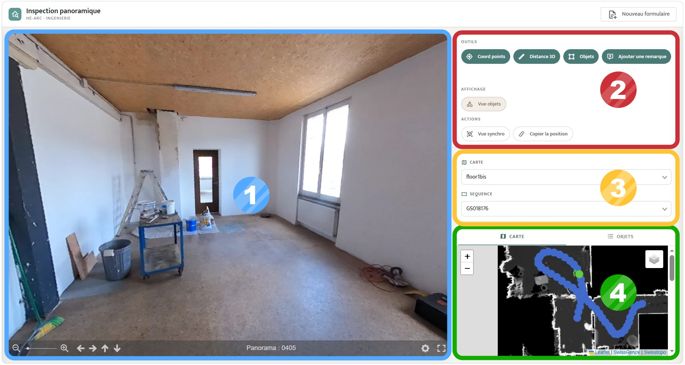

### ① Vue panoramique

Cette fenêtre permet de voir et d'interagir avec une image panoramique.

### ② Outils et actions

Cette boîte permet de sélectionner un outil pour interagir avec les images. Les différents outils sont présentés ultérieurement.

### ③ Filtrage et changement de carte 

Cette fenêtre permet de choisir la zone de la friche que l’on souhaite visiter. Il est possible de filtrer les images pour faciliter la visite.

### ④ Carte du site

La **carte** permet de voir la zone à visiter en affichant les points de vues panorqmiques consultables sur un plan du site.

## 2. Déplacements

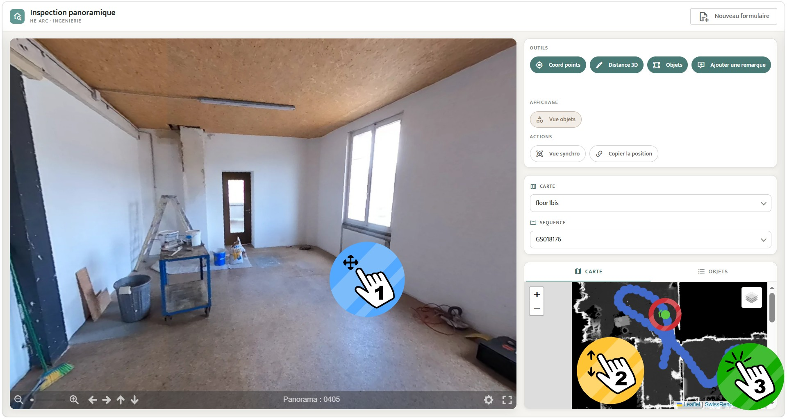

### ① Tourner dans la panoramique

Pour pivoter dans l'image, cliquer-glisser sur l'image et utiliser la molette pour ajuster le zoom.

### ② Se déplacer sur la carte

La **carte** est intéractive, il est possible de se déplacer sur la carte et de zoomer. Chaque panoramique consultable est représentée par un point bleu. Il suffit de cliquer sur un point bleu pour ouvrir la panoramiques dans la **Vue panoramique**. La panoramique affichée est alors représentée par un point vert avec une flèche sur la carte. La flèche indique la direction dans laquelle
on regarde sur la panoramique.

### ③ Changer de panoramique

Pour changer de point de vue panoramique, il suffit de cliquer sur un point bleu de la **carte**.

## 3. Outils de base

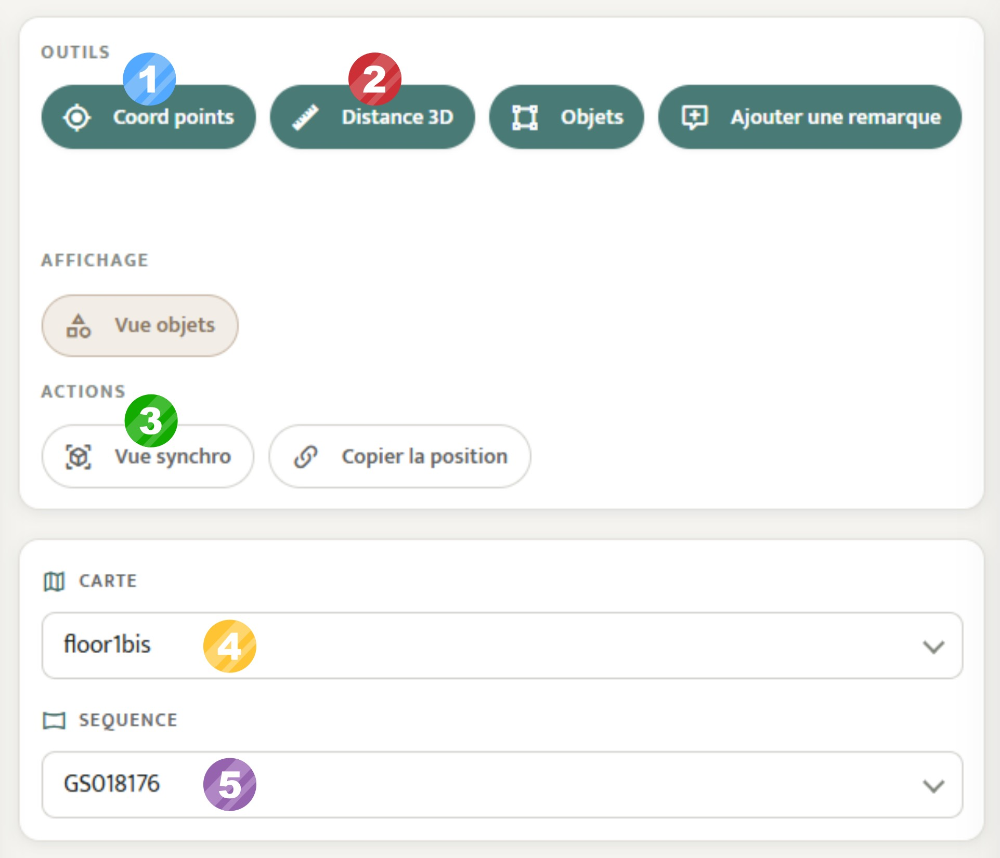

### ① Coordonnées d'un point

L’outil **Coord points** permet de cliquer un point dans l’image pour obtenir ses coordonnées dans le système Suisse (EPSG : 2056).

### ② Mesurer une distance

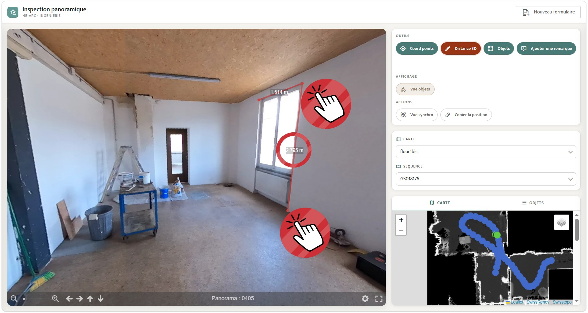

L’outil **Distance** permet de cliquer plusieurs points pour tracer une ligne ou polyligne.
Chaque segment d’une polyligne est accompagné d’une distance en mètre.

### ③ Vue synchronisée

La **Vue synchronisée** permet de passer sur le viewer **Potree** avec de la 3D en conservant le point de vue actuel.

### ④ Changer de carte

Une friche peut se décomposer en plusieurs zones et étages qui ne peuvent pas être représenté sur une seul carte. Le menu déroulant affiche la liste des **cartes** disponibles. Une fois
sélectionné, la fenêtre **carte se mets à jour.

### ⑤ Filtrer les panoramiques

Certaines cartes contiennent beaucoup de panoramiques, il est possible de les filtrer par séquence d'acquisition pour s'y retrouver.

>D’autres filtres de sélection peuvent être ajoutés dans le développement de ce
>viewer pour améliorer la recherche. (exemple : date, attribut, ré-échantillonnage … etc)

## 4. Outils de saisie

Les outils de saisie permettent d'annoter des informations sur les images, de les consulter et de les supprimer.

### ① Saisir une remarque  
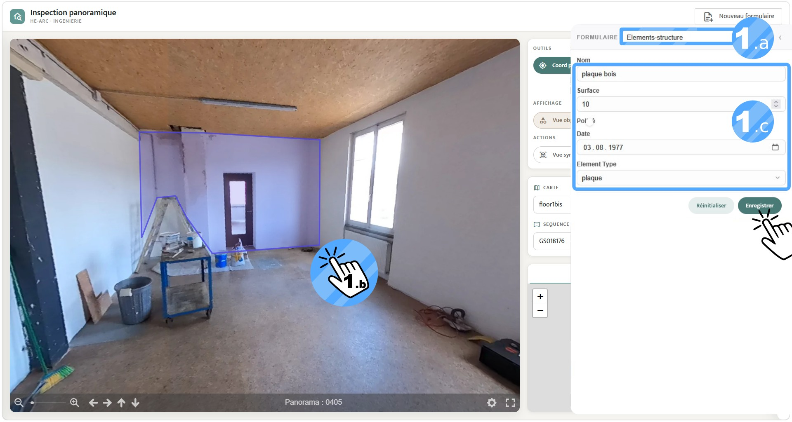

Cliquer sur l'outil **Ajouter une remarque**, un paneau s'ouvre sur la droite.
Il est possible de réduire ou développer ce panneau avec la flêche en haut à droite de ce panneau.

- **a. Choisir un Formulaire** : Une liste de formulaires s'affiche en cliquant sur le menu déroulant. Une fois le formulaire sélectionné, il s'affiche dans le panneau.
- **b. Détourer un objet** : Dans la **Vue panoramique**, détourer un objet en cliquant sur l'image.
- **c. Remplir le formulaire** : Remplir le formulaire dans le panneau avec des informations. Une fois terminé, cliquer sur **Enregistrer**.

### ② Saisir un objet

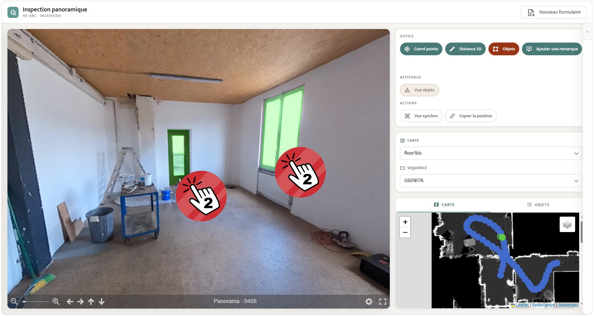

La saisie d'un **objet** se déroule comme la saisie d'une **remarque** à une subtilité pret. Cliquer sur l'outil **Objet**, le même panneau avec formulaire s'ouvre.
La différence se trouve pendant le détourage d'un objet dans l'image. Il suffit de cliquer sur un objet et celui-ci est détouré automatiquement. S'il n'y a qu'une partie de l'objet à être détouré, il suffit de cliquer à nouveau sur la partie manquante. Pour désélectionner un objet, faire un clique droit sur celui-ci.

### ③ Afficher des annotations  

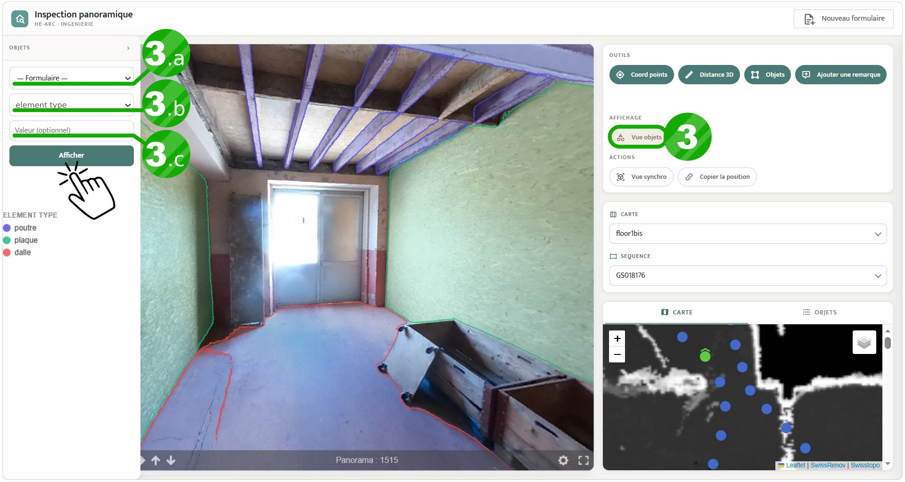

Cliquer sur l'outil **Vue objet**, un panneau s'ouvre sur la gauche. 
Il est possible de réduire ou développer ce panneau avec la flêche en haut à droite de ce panneau.

- **a. Choisir le formulaire** : Une liste de formulaires s'affiche en cliquant sur le menu déroulant.
- **b. Choisir un champs** : La liste des champs du formulaire sélectionné s'affiche. Une fois le champs choisis, cliquer sur **Afficher** pour que les annotations apparaissent sur l'image panoramique.
- **c. Choisir une valeur (optionnel)** : Si seulement une valeur spécifique vous intéresse, remplir la valeur puis cliquer sur **Afficher**. Seul les annotations avec cette valeur spécifique s'affichent alors sur l'image panoramique.

### ④ Supprimer des annotations

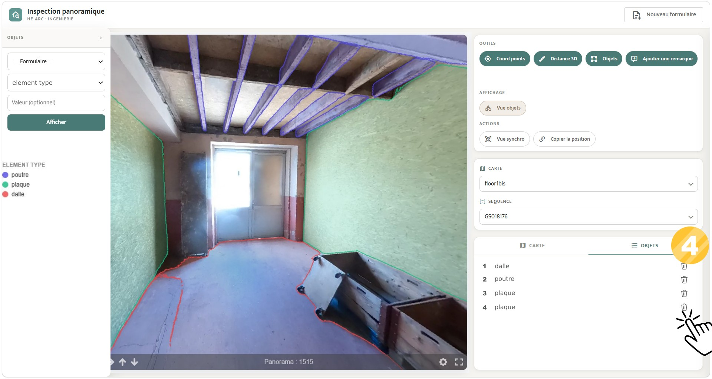

Lorsque des annotations sont affichées sur une images panoramique, il est possible de voir la liste des annotations dans l'onglet **Objets** dans la fenêtre de la **Carte**.
Sur cette liste apparait un icon de corbeille pour supprimer une annotation.

## 5. Affichage complémentaire

### ① Affichage sur la panoramique

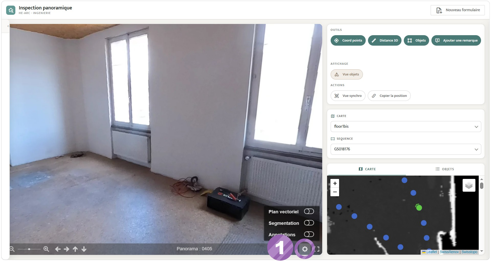

Dans la **Vue panoramique**, il est possible d’ajouter des informations complémentaires associées à l’image panoramique.

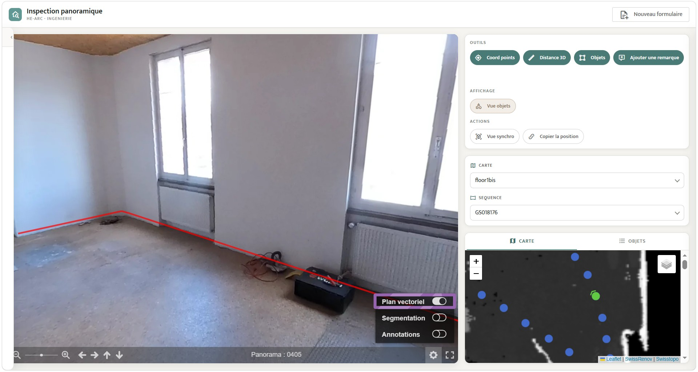

**Plan Vectoriel** : Un plan (dxf ou geojson) qui décrit des éléments de la friche comme des contours de murs, peut être superposé à un point de vue. Cela permet de mieux
évaluer les surfaces au sol, d’afficher des informations complémentaires ou des projections de réaménagement.

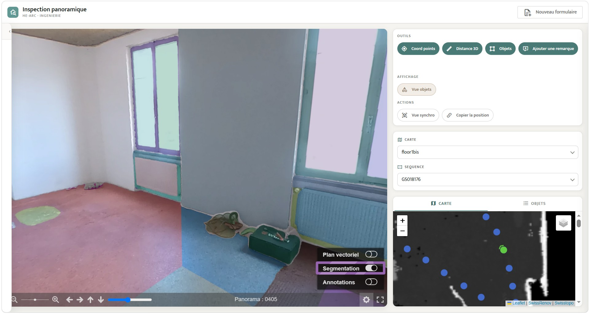

**Segmentation** : Les différents objets et éléments de l’image sont découpés automatiquement pour les distinguer. Cette visualisation permet de voir l’ensemble
des éléments. Certaines découpes droites ne correspondent pas à des objets, il s’agit d'artefacts liés au calcul automatique. Cela provoque des découpes supplémentaires dans un même objet.

### ② Affichage sur la carte

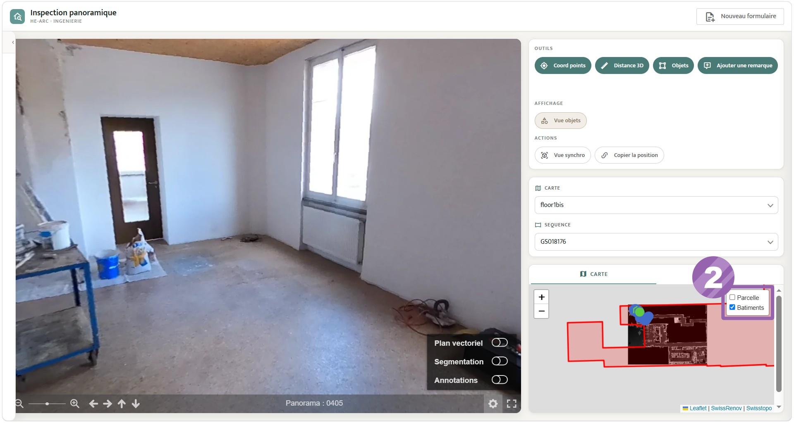

Sur la **Carte**, il est possible d’afficher différentes informations supplémentaires. Dans l'onglet
en haut à droite, des informations issues de Swisstopo permettent de mieux comprendre le
site et les éléments qui l'entourent

>Les informations affichées se limitent pour le moment aux contours de la
>parcelle et du bâtiment. Cela peut être enrichi avec d’autres informations et/ou sources

## 6. Outils d'export

!!! warning 
    Système en cours de développement