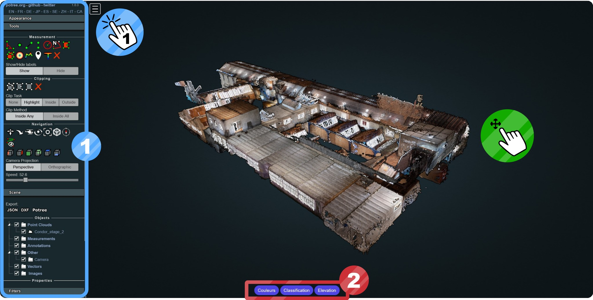
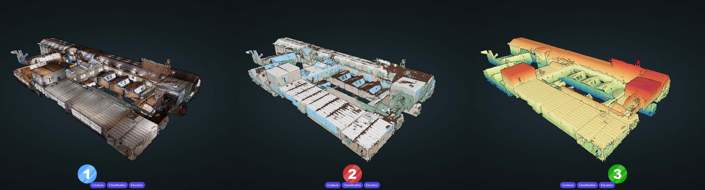
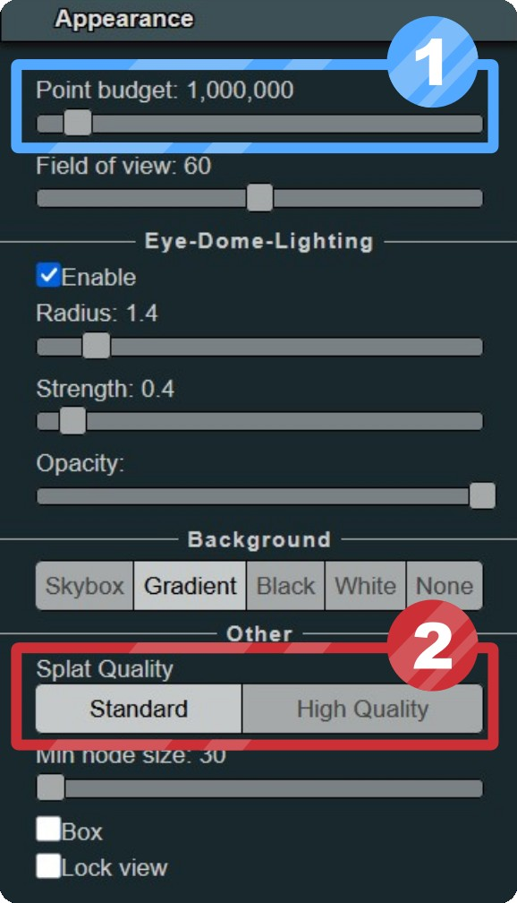
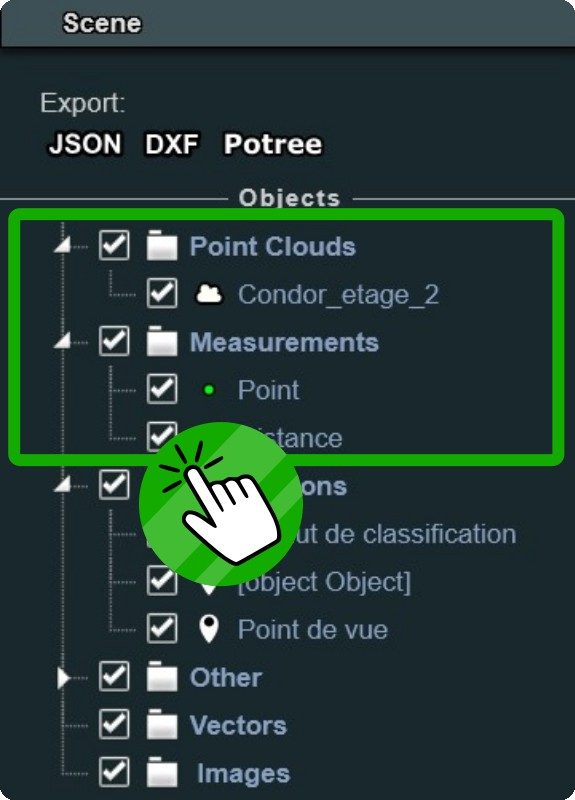
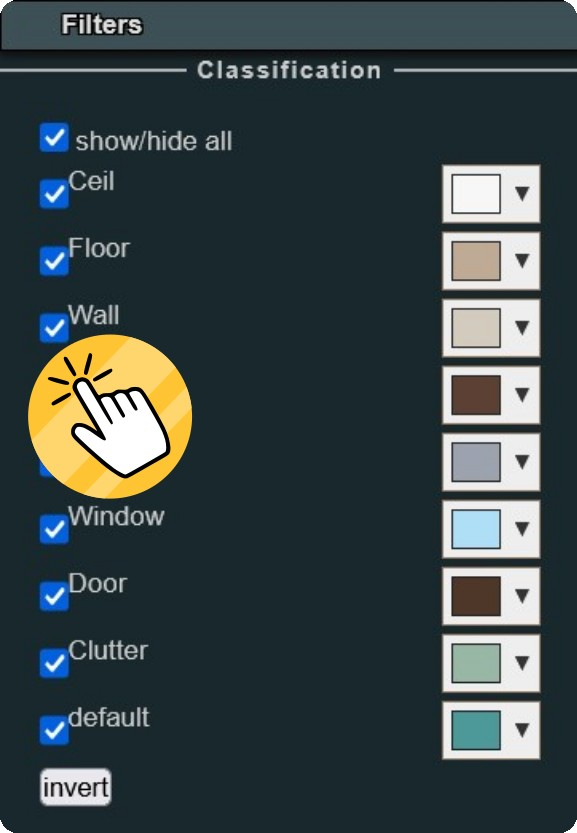
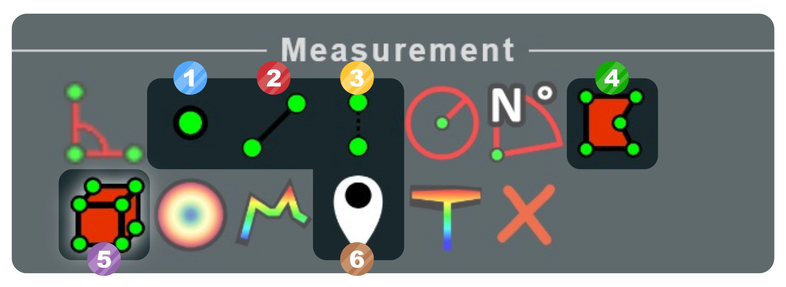
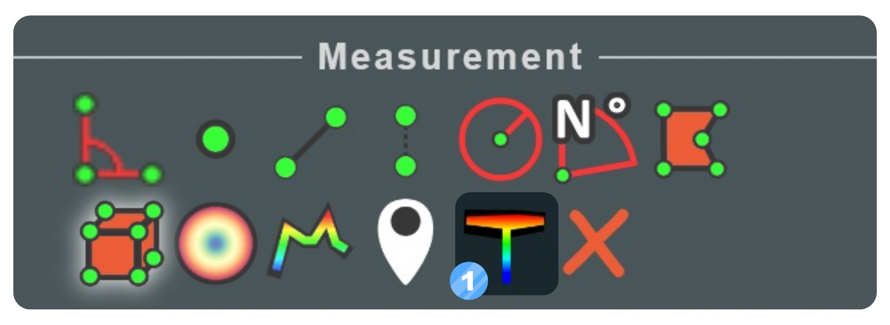
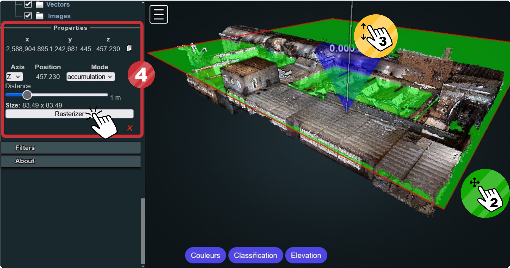
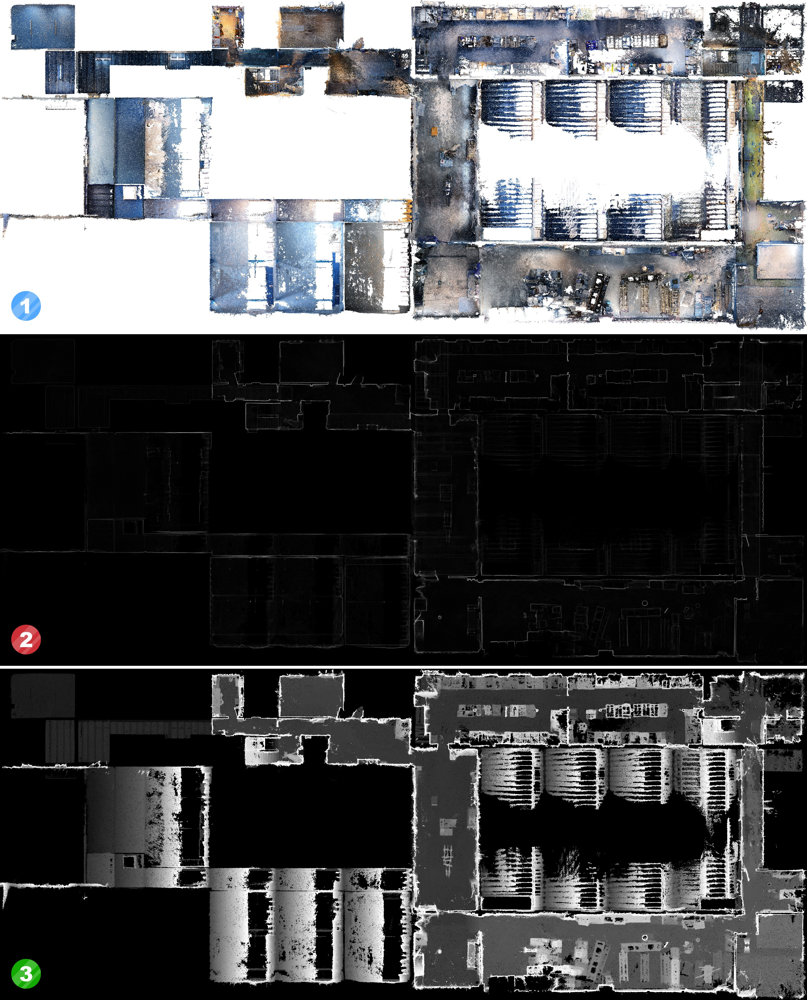

# Quickstart - Visite Potree

## 1. Interface

### ① Menu Potree

Le **Menu** est accessible en cliquant sur le carré blanc en haut à gauche. Un panneau s'ouvre avec plusieurs onglets :

- **Appearance** : Apparence du nuage de points. [Voir paramètres](#amelioration-du-nuage-de-points).
- **Tools** : Outils de mesures, d'extraction et de navigation. Voir sections **[3](#3-outils-de-base)**, **[4](#4-outil-de-coupes-rasterisation)** et **[5](#5-outil-dextraction)** pour plus d'informations sur les outils.
- **Scene** : Détails des objets 3D et mesures présentes dans la vue 3D. [Voir paramètres](#objets-dans-la-scene).
- **Filters** : Filtrage des éléments du nuage de points. [Voir paramètres](#filtrage-du-nuage-de-points).
- **About** : Information générales et crédit de la plateforme Potree.

### ② Mode de Visualisation

Différents modes de visualisation sont accessibles via les 3 boutons en bas au centre de la vue 3D

## 2. Visualisation

### Mode de visualisation

Les 3 modes de visualisations par défaut sont les suivants :

- **① Couleurs** : Nuage de points colorisé, issu de la reconstruction par photogrammétrie.
- **② Classification** : Couleur par type d’éléments. La classification est réalisée
automatiquement par Deep Learning (Modèle RandLaNet).
- **③ Elevation** : Gradient de couleur suivant l’altitude des points.

### Amélioration du nuage de points

Il est possible d'améliorer le rendu visuel du nuage de points. Par défaut, les paramètres sont bas pour garantir de bonnes performances.

- **① Point budget** : Nombre de points afficher dans la page web. Avec une machine performante, ce paramètre peut être passé au dessus de 6 Millions sans soucis.
- **② Splat Quality** : Par défaut, les points ont une forme carré dans la vue 3D. En haute qualité, les points sont des rond, le rendu est beaucoup plus esthétique.

### Objets dans la scène

Les différents objets 3D (nuages de points, mesh, shapefiles) et les mesures réalisées sont listées dans l'onglet **Scene**. En décochant ou cochant un élément, cela permet de faire disparaitre ou apparaitre cet élément dans la vue 3D. En cliquant sur un élément, cela permet d'accéder à ses [Propriétés](#proprietes-doutils).

### Filtrage du nuage de points

Il est possible de filtrer le nuage de points pour afficher seulement certaines classes de la classification. Les détails et options de la classification sont accessibles dans le **Menu** ▶ onglet **Filters**. Dans l’onglet **Filters**, chaque classe peut être activée ou désactivée pour ne voir qu’une partie du nuage de points.

## 3. Outils de base

### Liste des outils de base  

Plusieurs outils sont disponible dans Potree. Les essentiels sont détaillés ici.

- **① Mesure de point** : Mesurer les coordonnées d'un point (système Suisse EPSG 2056).
- **② Mesure de distance** : Mesurer une distance en cliquant 2 points ou plus.
- **③ Mesure de hauteur**: Mesurer une hauteur verticale entre 2 points
- **④ Mesure de surface**: Mesurer une surface horizontale en m²
- **⑤ Mesure de volume** : Mesurer un volume en m³
- **⑥ Annotation** : Ajouter une annotation avec un commentaire dans la 3D

### Propriétés d'outils

Chaque outil permet de créer une mesure dans la scène 3D. Une mesure possède des propriétés consultable et éditable dans le **Menu** ▶ onglet **Scene** ▶ section **Properties**.

>Les Pointclouds possèdent aussi des **properties** pour modifier et personnaliser le mode de visualisation au dela des [modes par défaut](#mode-de-visualisation).

## 4. Outil de coupes (rasterisation)

### Utilisation

L’outil Rasteriser est accessible dans le **Menu** ▶ onglet **Tools** avec l’icon **T**. Un plan horizontal vert apparaît dans la vue 3D. Il suffit de cliquer sur un point du nuage pour fixer le
plan au niveau de ce point. Il est ensuite possible de réajuster la position du plan en le faisant coulisser grâce à la barre blanche au centre du plan. Le cône bleu indique la direction de vue et peut être modifié dans les **Properties**.

- **① Séléctionner** l'outil de rasterisation.
- **② Placer** le plan en cliquant sur un point du nuage.
- **③ Ajuster** la position du plan à l'aide de la barre blanche.
- **④ Modifier** les paramètres et lancer la rasterisation dans les **Properties**.

### Propriétés

Une fois l’outil Rastériser cliqué, il peut être paramétré dans le **Menu** ▶ onglet **Scene** ▶ section **Properties**. Les différents paramètres offrent la possibilité d’extraire des coupes.

- **Position** : Information de position du plan. Pour modifier la position du plan, il faut
faire glisser le plan dans la vue 3D à l’aide de la barre blanche de translation.
- **Axis** : Axe du plan de coupe et de la direction. Le cône attaché au plan dans la vue
3D permet de vérifier la direction.
- **Mode** : Type d’image à produire (*couleur, accumulation, hauteur*).
- **Distance** : Distance de sélection du nuage 3D à partir du plan dans le sens de la
direction (entre 0.1 et 5 mètres).

### Exemples

- **① Ortho-image couleur** : Image plan en couleur de la zone
- **② Carte d'accumulation** : Accumulation de points, permet de faire ressortir les murs.
- **③ Carte de hauteur**: Hauteur maximal pour chaque pixel. 

## 5. Outil d'extraction

1. Profile de hauteur

!!! warning 
    Système en cours de développement

## 